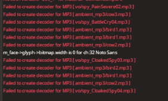

## Let's say you're playing TF2

On 2Fort. As a spy. Well, we don't need more spies on 2Fort than we already have, but oh well. You call out another spy, but wait.. you can't hear your voice line! If you're playing on Linux, this is most likely caused by SELinux.

## How do I know?

Open the TF2 console (I hope you have this, if not, just ignore this I guess, but I encourage you to enable it). Do you see anything like this?



If so, this applies to you.

## How to fix it

I'm not going to go into detail about what SELinux is or what distros use it, but if the command below doesn't say "command not found" you most likely are using it.

```
setsebool -P selinuxuser_execheap 1
```

Restart Team Fortress 2 after this. You should hear other sounds working, and of course, you'll be able to call out spies and hear the voice line. Neat, huh?

## Related links

[Bug report @ Red Hat Bugzilla](https://bugzilla.redhat.com/show_bug.cgi?id=1503760#c0)