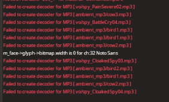

## La oss si at du spiller TF2

På 2Fort. Som Spy. Egentlig, trenger vi ikke flere spioner på 2Fort, jeg synes vi har for mange av dem, men sånn er det. Du roper ut om en annen Spy, men... du kan ikke høre din egen stemme! Hvis du spiller på Linux, så er dette sikkert forårsaket av SELinux.

## Hvordan sjekker jeg?

Åpne TF2-konsollen (Jeg håper du har dette, hvis ikke, bare hopp over dette, men du bør virkelig skru det på). Ser du noe slikt?



Hvis du gjør dette, så gjelder dette deg.

## Hvordan fikser jeg dette?

Jeg har ikke lyst til å gå i detalj om SELinux og hvilke Linux-distribusjoner som bruker det, men hvis kommandoen nedenfor ikke sier "kommando ikke funnet", så bruker du det sikkert.

```
setsebool -P selinuxuser_execheap 1
```

Husk å starte Team Fortress 2 på nytt etter dette. Når du er tilbake i spillet, så skal du høre andre lyder fungere, og selvfølgelig, så kan du rope ut om en annen Spy. Fint, er det ikke?

## Relaterte lenker

[Bug-rapport @ Red Hat Bugzilla](https://bugzilla.redhat.com/show_bug.cgi?id=1503760#c0)